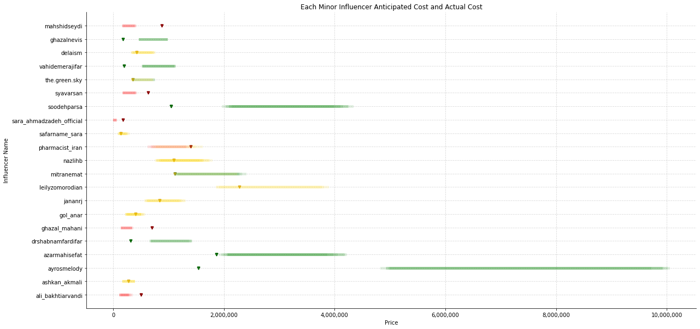

<!-- PROJECT SHIELDS -->


[](https://www.linkedin.com/in/raminferdos/)
[
](mailto:ferdos.ramin@gmail.com)
[](https://Pull-Up-Campaign-Analysis/)

<!-- PROJECT LOGO -->
<br />
<div align="center" id=readme-top>
  <h3 align="center">"Pull Up" Advertising Campaign Analysis</h3>

  <p align="center">
    Data-Driven Analysis of "Pull Up" Advertising Campaign
    <br />
    <a href="https://github.com/SimplyRamin/Pull-Up-Campaign-Analysis"><strong>Explore the docs »</strong></a>
    <br />
    <br />
    <a href="https://github.com/SimplyRamin/Pull-Up-Campaign-Analysis">View Demo</a>
    ·
    <a href="https://github.com/SimplyRamin/Pull-Up-Campaign-Analysis/issues">Report Bug</a>
    ·
    <a href="https://github.com/SimplyRamin/Pull-Up-Campaign-Analysis/issues">Request Feature</a>
  </p>
</div>


<!-- TABLE OF CONTENTS -->
<details>
  <summary>Table of Contents</summary>
  <ol>
    <li>
      <a href="#about-the-project">About The Project</a>
      <ul>
        <li><a href="#overview">Overview</a></li>
        <li><a href="#methodology">Methodology</a></li>
        <li><a href="#exploratory-data-analysis">Exploratory Data Analysis</a></li>
        <li><a href="#key-insights">Key Insights</a></li>
        <li><a href="#participating-universities">Participating Universities</a></li>
        <li><a href="#data-sources">Data Sources</a></li>
        <li><a href="#built-with">Built With</a></li>
      </ul>
    </li>
    <li><a href="#usage">Usage</a></li>
    <li><a href="#contributing">Contributing</a></li>
    <li><a href="#license">License</a></li>
    <li><a href="#contact">Contact</a></li>
    <li><a href="#acknowledgments">Acknowledgments</a></li>
  </ol>
</details>


<!-- ABOUT THE PROJECT -->
## About The Project



### Overview

This project focuses on the comprehensive analysis of the "Pull Up" Advertising Campaign, a 360-degree marketing initiative carried out for a well-known brand of adult diapers in Iran. The campaign was executed by SISARV Marcom Agency. Our primary objective was to assess the campaign's effectiveness using a data-driven approach.
### Project Highlights
- ***Data-Driven Approach***: We approached this analysis using a data-driven methodology, leveraging statistical techniques and machine learning algorithms to draw meaningful insights.

- ***Data Preprocessing***: We began by handling missing data and employing imputation techniques to ensure the data's integrity.

- ***Effectiveness Assessment***: We established a threshold and calculated the effectiveness of each paid advertising medium based on views. This allowed us to determine whether each medium provided value for our investment, helping us make informed decisions.

- ***Introducing 'Benefit' Category***: To encapsulate the concept of media effectiveness, we introduced a categorical feature called 'benefit.' This feature helps classify each medium as either delivering substantial benefits, cost overruns, or cost savings.

- ***Descriptive and Exploratory Analysis***: We conducted comprehensive descriptive and exploratory data analyses to gain insights into the dataset. This included visualizations, statistical summaries, and correlation analysis of the key features.

- ***Predictive Modeling***: We developed predictive models to forecast the benefit status of a new advertising medium. This involved extensive hyperparameter tuning and experimentation with various algorithms.

- ***Unsupervised Learning***: In addition to supervised learning, we explored an unsupervised learning approach using clustering techniques to uncover patterns within the data.
### Built With

This research project was powered by a robust set of tools, libraries, and frameworks that facilitated data processing, analysis, and visualization:

- 
: The primary programming language for data manipulation, analysis, and visualization.

- : Used for interactive data exploration, analysis, and documentation, providing an intuitive environment for code execution and visualization.

- : scikit-learn is a versatile machine learning library in Python that offers simple and efficient tools for data analysis and modeling, including classification, regression, clustering, and more.

- : NumPy is a fundamental package for scientific computing with Python, providing support for arrays and matrices, as well as a wide range of mathematical functions.

- : A versatile data manipulation library for cleaning, processing, and analyzing structured data.

- Seaborn: A powerful statistical data visualization library that enhances the presentation of insights through beautiful and informative plots.

- : A widely-used data visualization library that offers extensive customization and control over plot aesthetics.

Feel free to explore the codebase to see how these elements come together to create this portfolio website.

<p align="right">(<a href="#readme-top">back to top</a>)</p>

<!-- HOW TO USE THIS REPOSITORY -->
## Usage
- Clone this repository to your local machine if you wish to replicate or build upon the work presented here.
```bash
git clone https://github.com/SimplyRamin/Pull-Up-Campaign-Analysis.git
```

- Open the notebook you want to check.

<p align="right">(<a href="#readme-top">back to top</a>)</p>

<!-- CONTRIBUTING -->
## Contributing

Contributions are what makes the open-source community such an amazing place to learn, inspire, and create. Any contributions you make are **greatly appreciated**.

If you have a suggestion that would make this better, please fork the repo and create a pull request. You can also simply open an issue with the tag "enhancement".
Don't forget to give the project a star! Thanks again!

1. Fork the Project
2. Create your Feature Branch (`git checkout -b feature/AmazingFeature`)
3. Commit your changes (`git commit -m 'Add some AmazingFeature'`)
4. Push to the Branch (`git push origin feature/AmazingFeature`)
5. Open a Pull Request

<p align="right">(<a href="#readme-top">back to top</a>)</p>


<!-- LICENSE -->
## License

Distributed under the MIT License. See `LICENSE.txt` for more information.

<p align="right">(<a href="#readme-top">back to top</a>)</p>


<!-- CONTACT -->
## Contact

Ramin F. - [@SimplyRamin](https://www.linkedin.com/in/raminferdos/) - ferdos.ramin@gmail.com - [Website](https://Pull-Up-Campaign-Analysis)

Project Link: [https://github.com/SimplyRamin/Pull-Up-Campaign-Analysis](https://github.com/SimplyRamin/Pull-Up-Campaign-Analysis)

<p align="right">(<a href="#readme-top">back to top</a>)</p>


<!-- ACKNOWLEDGMENTS -->
## Acknowledgments

I would like to express my gratitude to the data science community for its constant inspiration and support. This project is a testament to the power of data-driven insights and the endless possibilities they offer in understanding and optimizing social media engagement.

I would like to express my sincere gratitude to [SISARV Marcom Agency](https://www.sisarv.com/) for their generous support and collaboration in providing the essential data for this project. Their valuable contribution was instrumental in enabling this in-depth analysis of the "Pull Up" Advertising Campaign. Their commitment to data-driven decision-making played a crucial role in the successful execution of this project.
I extend my appreciation to the entire team at SISARV Marcom Agency who were involved in the collection and sharing of the campaign data. This project would not have been possible without their cooperation and the trust they placed in my analysis efforts.


<p align="right">(<a href="#readme-top">back to top</a>)</p>